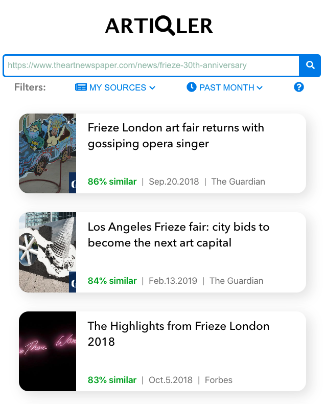

<p align="center">
  
</p>


# Table of Content

- [Table of Content](#table-of-content)

  - 1. About the app

  - 2. Libraries & Frameworks

  - 3. Installation & Set Up

    

## 1. About the app

Artiqle is simple web application optimized for mobile, where the use can paste any articles from the internet and will get a number of articles containing similar content to the original one. The app combines two api's for extracting data and generate recommendations based on that data.


## 2. Libraries & Frameworks

| Name                  |                                                    |
| --------------------- | -------------------------------------------------- |
| React                 | A JavaScript library for building user interfaces. |
| React-testing-library | Built-in library for testing                       |
| Lateral API's         | Similar-to-text / Article extractor                |

## 3. Installation & Set Up

1. Clone the repo

```
git clone https://github.com/pintoedo/lateral.git
```

2. Install project dependencies

```bash
 npm install
```

3. Add environment variables on your `.env.local`

```env
 REACT_APP_API_KEY=
```

4. Start the development server

```bash
 npm start
```

5. Build for production

```bash
 npm run build
```
## Author

Eduardo pinto - [Github](https://github.com/pintoedo) - [LinkedIn](https://www.linkedin.com/in/pintocodes/)


## License

This project is licensed under the MIT License.
